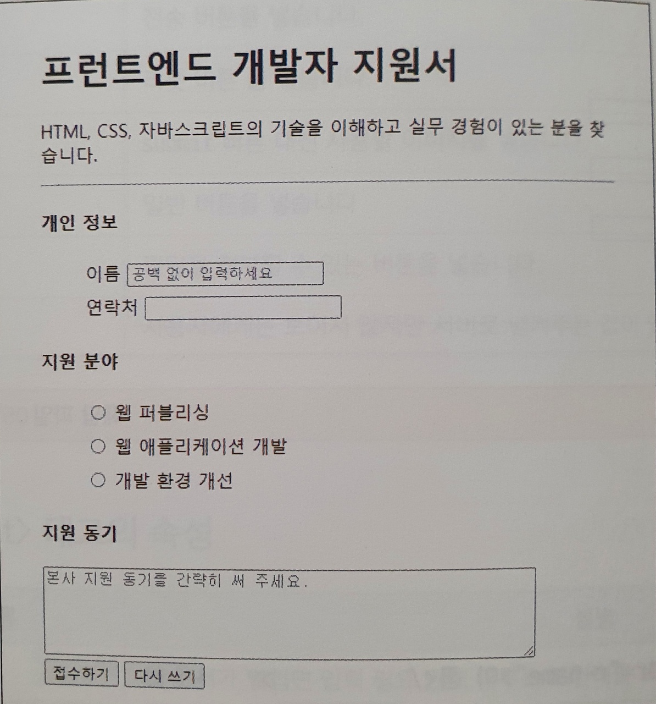

### **1. HTML이란?**

- Hyper Text Markup Language 의 약자
- **웹페이지의 틀**을 만드는 마크업 언어
- 마크업언어: 태그 등을 이용 문서/데이터 구조 명기 

### **2. HTML의 사용법**

- HTML은 tag들의 집합 (트리구조로 구성)
- tag : 부등호(<>)로 묶인 HTML의 기본 구성 요소

### **3. 주요 HTML 태그**

- 영역구분

1. div (division) : 한 줄을 차지하는 구분 요소(의미적 구분 x)
2. span (span) : 컨텐츠 크기만큼 차지하는 구분 요소
3. section : 큰 의미 단위를 구분하는 구분 요소  
   [참고링크 - div와 section에 관한 스택오버플로우 글](https://stackoverflow.com/questions/6939864/what-is-the-difference-between-section-and-div/6941170#6941170)

- img (image) : 이미지 삽입
- a (link) : href 속성과 함께 사용 시 링크 이동
- ul & ol & li (list) : ul(순서없는), ol(순서있는) 리스트
- input (text, box)

1. input : 한 줄로 된 입력 값을 받을 때 사용
2. radio box : 하나의 옵션만 선택 가능(name 속성으로 그룹화 필요)
3. check box : 여러 옵션을 중복선택 가능

- textarea (muti-line text) : 줄바꿈이 되는 입력창
- button (button)

### **4. 예제 문제풀이**



- 모범 답안

```html
<ul>
	<li>
		<input>태그 앞 뒤에 <label>과 </label> 태그로 묶어도 됩니다
			<label for="sname"> 이름 </label>
			<input type="text" id="sname" autofocus placeholder="공백없이 입력하세요">
	</li>
	<li>
			<label for="snumber"> 연락처 </label>
			<input type="text" id="snum">
	</li>
</ul>
<h4>지원 분야</h4>
<ul>
	<li>
		<label><input type="radio" name="field" value="an"> 웹 퍼블리싱</label>
	</li>
	<li>
		<label><input type="radio" name="field" value="pd"> 웹 애플리케이션 개발</label>
	</li>
	<li>
		<label><input type="radio" name="field" value="eng"> 개발 환경 개선</label>
	</li>
</ul>

```
