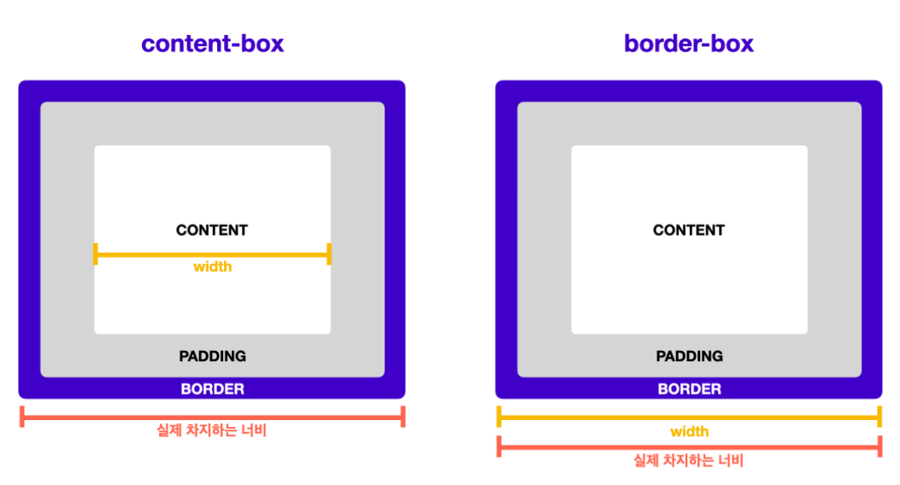

### **1. CSS와 박스 모델**
: 웹문서의 내용을 박스 형태로 정의하는 방법

### **2.블록 & 인라인 레벨 요소**

1. 블록 레벨 요소 : 요소가 한 줄 영역 차지(너비 100%)
   `<div>, <h1>, <p>` 태그 등

2. 인라인 레벨 요소 : 요소가 컨텐츠만큼 영역 차지
   `<span>, , <strong>` 태그 등   

3. display 속성 : 인라인 <-> 블록 레별 변경
   (none 선택 시 화면에서 표시하지 않음*)

&nbsp; |block|inline-block|inline
---|---|---|---
줄바꿈|O|X|X
기본너비|100%|글자크기만큼|글자크기만큼
크기조정|가능|가능|불가능

* visibility : hidden은 화면에서 감추기만 할뿐 공간 차지

[참고자료 - [CSS입문] CSS와 박스모델](https://pyeonne.tistory.com/33)


### **3.박스모델의 기본 구성**

1. border : 박스의 테두리
2. padding : 박스와 콘텐츠 사이 여백
3. margin : 여러 박스 모델 사이 여백 

[박스모델의 기본 구성](../_posts/images/2021-10-17-image.png)

### **4.박스모델의 기본 조작**

1. border : 두께, 종류, 색상 지정 가능
```javascript
p {
  border: 1px solid red;
}
```
2. padding : 박스와 콘텐츠 사이 여백
```javascript
p {
  padding: 10px 20px 30px 40px
}
```
3. margin : 여러 박스 모델 사이 여백 
```javascript
p {
  margin: 10px 20px 30px 40px
}
```

* 박스모델의 방향은 top -> right -> bottom -> left
(스타일 옵션 적용 시 위 순서대로 적용)  
a. 1개 옵션 : 4방향에 동일 적용  
b. 2개 옵션 : 순서대로 상/하, 좌/우에 적용
b. 3개 옵션 : 빠진 왼쪽 옵션이 오른쪽과 동일


### **5.박스크기의 측정기준*

1. content-box : 박스크기 측정 시 콘텐츠 영역만 계산(기본)
2. border-box : 박스크기 측정 시 여백/테두리 두께까지 계산

```javascript
* {
  box-sizing: border-box;
}
// 기본값인 content-box 보다 border-box를 권장
// 위 처럼 모든 요소에 border-box적용시 계산 편리
```


3. 콘텐츠가 박스를 넘어갈 때
```javascript
p {
  height: 40px;
  overflow: auto;
}
// overflow 적용 시 넘치는 부분 스크롤 생성
```


```javascript
```
`<code>` 코드강조

[링크명](링크주소)    


*** 
수평선

>인용
>>인용2

| | |
---|---
| | |
| | |