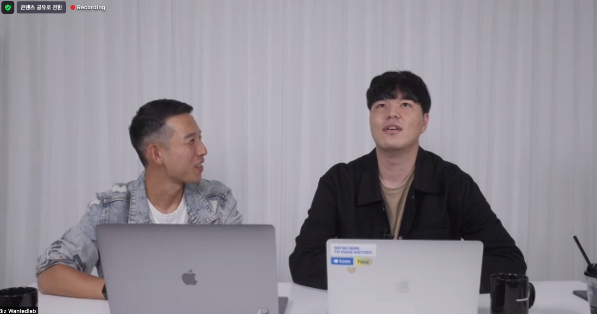
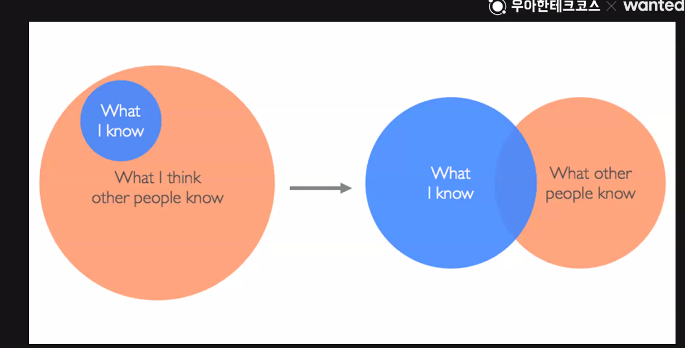

### **1. 연사 및 주제**
 - 연사 : 양성민 (현 토스페이먼츠 프론트개발자)
 - 주제 : 2년차 프론트엔드 개발자의 생각들

### **2. 주요 내용 정리**    

**- 지원할 회사를 고를 때**    
: 기술블로그가 있는가? DevRel팀이 있는가? '콜드메일'을 이용하자! 컨퍼런스 등 개발자들과 만나면서 직접 발로 뛰자    
-> 강연을 들으면서도 내가 아는 것과 다른 부분들이 많았다. 특히 연사님은 미국방문을 하실 때 구글에 계신 김종민님에게도 메일을 보내 구글견학 및 몇시간 동안 많이 배울 수 있었다고 한다. 나 또한 용기를 내어 연락을 해봐야 겠다.

**- 면접에서는 모르면 모른다고 하는 것이 중요하다**    
  : 개발기술은 변화가 빠르므로 어느부분을 모르는지에 대한 메타인지도 중요한 부분이므로(다만, 진짜 모를때는 실천하기 힘들다)     
  -> 모르는 것을 모른다고 하는게 중요하다고 여럿 들었었는데, 오늘 제대로 알게 된 것 같다. 다만, 잘 실천할 수 있으려면 어느정도 실력을 갖추어야 할 것이다. 또한 마음가짐적으로도 허세나 욕심을 버려야 한다 

**- imposter 신드롬에서 벗어나자**    
  : react를 총괄하는 Dan Abramov조차도 모든 것을 아는 것이 아니며 힘겨워 할때가 있다          
  다른 사람들을 과대평가하지 말고 자신의 길을 걷자

[글 링크](https://overreacted.io/ko/things-i-dont-know-as-of-2018/)

**- 면접관으로 들어가봐서야 알게된 내용**
  : 운칠기삼이 아닌 '실력이 95%'     
    이력서에는 자신있는 핵심기술만 (연사님은 React, TS만 쓰실정도)     
    어려운면접을 보면 들어가서 서로 믿고 신뢰하며 인정받을 수 있다 긍정적으로 생각하자

**- 기타**
- NPS (Net Promoter® Score): 고객만족도 측정방법, IT기업들이 중요시하는 지표, 고객들이 회사를 친구에게 추천할 정도로 좋아하는지

**"마음대로 되는 일이 하나도 없다. 그래서 순간순간이 재미있다." - 공지영**

연사님은 어려울 때 저 문장을 보면서 많이 힘을 내셨다고 한다. 나도 개발공부를 하며 어려운 부분이 있겠지만 긍정적으로 받아들이고 성장의 발판으로 삼아야 겠다

[강연소개 링크](https://www.wanted.co.kr/events/livetalk42)

