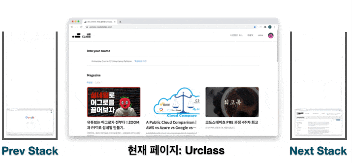

기존 알고리즘 문제풀이에서 종종 활용한 stack의 정의와 기본예제를 풀어보았다.  
기초 문제에서는 정확한 쓰임새를 알기어려웠는데 웹브라우져 예시를 보니 쉽게 이해할 수 있었다.  
이전에 react에서 사용한 history()도 스택을 이용한 것이라 생각이 든다. 필요하다면 실전에서도 꼭 구현해 보고 싶다!  

### **1. Stack의 기초**

- stack은 `쌓다`, `포개지다` 라는 의미의 영어단어
- 데이터를 순서대로 쌓는 자료구조
- 먼저 들어간 데이터가 나중에 나옴(LIFO, FILO)

1. stack의 사용 예제


- 단방향의 stack을 활용 웹 뒤로가기/앞으로가기 구현
- 이전 페이지, 현재, 이후페이지를 별도로 관리

```javascript
function webBrowser(actions, start) {
    let prev=[];
    let next=[];
    let nowP=start;
    for(let i=0; i<actions.length; i++){
    if(typeof actions[i]==='string'){
      next=[];
      // 새 페이지 접속 시 앞으로가기 stack 리셋 됨
      prev.push(nowP)
      nowP = actions[i];
    } else if(typeof actions[i]==='number') {
      if(actions[i]===-1 && prev.length>0){
        next.push(nowP);
        nowP=prev.pop();
      } else if(actions[i]===1 && next.length>0){
        prev.push(nowP)
        nowP=next.pop();
      }
    }
  }
  let answer = [prev, nowP, next]
  return answer
}
let actions = ["B", "C", -1, "D", "A", -1, 1, -1, -1];
let start = "A";

webBrowser(actions, start);
```
