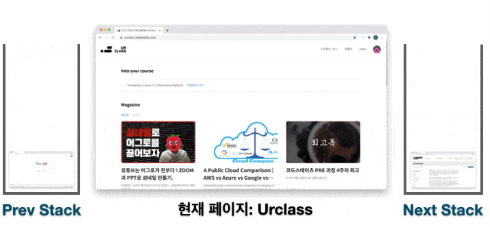

### **1. Stack의 기초**

- stack은 `쌓다`,`포개지다`라는 의미의 영어단어
- 데이터를 순서대로 쌓는 자료구조
- 먼저 들어간 데이터가 나중에 나옴(LIFO, FILO)

- stack의 사용 예제


```javascript
function webBrowser(actions, start) {
    let prev=[];
    let next=[];
    let nowP=start;
    for(let i=0; i<actions.length; i++){
    if(typeof actions[i]==='string'){
      next=[];
      prev.push(nowP)
      nowP = actions[i];
    } else if(typeof actions[i]==='number') {
      if(actions[i]===-1 && prev.length>0){
        next.push(nowP);
        nowP=prev.pop();
      } else if(actions[i]===1 && next.length>0){
        prev.push(nowP)
        nowP=next.pop();
      }
    }
  }
  console.log('prev',prev,'next',next,'nowP',nowP)
  let answer = [prev, nowP, next]
  return answer
}
let actions = ["B", "C", -1, "D", "A", -1, 1, -1, -1];
let start = "A";

webBrowser(actions, start);
```
